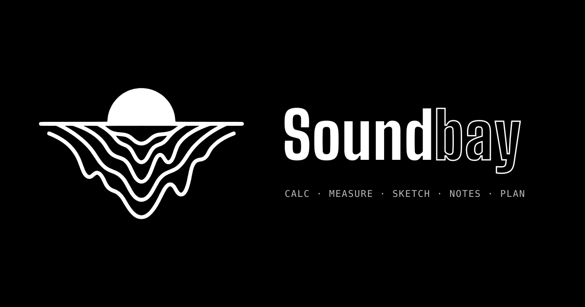

# Soundbay

A workbench for sound engineers, sound designers and field recordists: calculators, a measurement bench, a sketch pad you can play as a graphic score, a notebook with a take log, and a planner with kit checklists. One static page, no build step, no server.



## What's inside
- **Calc**: room modes, RT60 (Sabine/Eyring, EBU Tech 3276 target), critical distance, porous / panel / perforated absorbers, QRD diffuser, listening position and first reflections, delay and comb filtering, tempo and note values, samples / frames / timecode, signal levels, SPL and speaker power, adding levels, noise exposure, recording storage, wavelength and notes.
- **Measure**: signal generator (sine, pink, white, log sweep, 1 kHz line-up); file analyser (peak, RMS, crest, DC, BS.1770 loudness, spectrum); reverb time from an impulse response (EDT, T20, T30 per octave). Files never leave the browser.
- **Sketch**: draw ideas and play them back: height is pitch, left to right is time, colour is timbre.
- **Notebook**: notes with projects and tags, take log, Markdown and CSV export.
- **Planner**: Ideas / Next / Doing / Done, dates, checklists and templates.

## Saving sessions
- **On this device:** everything is saved in the browser automatically.
- **In an account:** once the API in `/api` is deployed and its address is in `config.js`, anyone can create an account (email + password) and their sessions sync to every device they sign in on. Changes made offline sync when the device is back online.
- **As PDF:** "Save PDF" (top right) makes a printable report of one project or everything: notes, take log, planner with checklists, and sketches. Single notes and the take log also have their own PDF button.
- **Backup file:** "Your sessions" → "Save backup" writes one JSON file with everything; "Load backup" merges it on another device.

## Files
```
index.html               the whole app
config.js                address of the account API (empty = this device only)
favicon.svg              browser tab icon
manifest.webmanifest     install-as-app metadata
assets/logo.svg          logo, black on transparent (vector)
assets/logo-white.svg    logo, white on transparent (vector)
assets/logo.png          logo, black, 1600 px wide
assets/logo-white.png    logo, white, 1600 px wide
assets/logo-tile.svg     logo, white on black square
assets/icon-192.png      app icons
assets/icon-512.png
assets/apple-touch-icon.png
assets/og.png            social preview, 1200 × 630
.github/workflows/pages.yml   deploys to GitHub Pages on every push to main
api/                     account server (Cloudflare Worker + D1), see api/README.md
```

## Deploy
1. Create a new repo (e.g. `soundbay`) and upload the contents of this folder to the root, including the hidden `.github` folder and `.nojekyll`.
2. Repo **Settings → Pages → Build and deployment → Source: GitHub Actions**.
3. Push to `main` (or run the workflow from the Actions tab). The site appears at `https://<username>.github.io/soundbay/`.
4. For accounts, follow `api/README.md`, then put the API address in `config.js` and push again.

### Custom domain (optional)
- DNS: add a CNAME record `soundbay` → `<username>.github.io`.
- Repo **Settings → Pages → Custom domain**: `soundbay.danielbovolon.com`, then tick **Enforce HTTPS** once the certificate is issued.
- No CNAME file is needed because the site deploys with GitHub Actions.

© Daniel Bovolon
